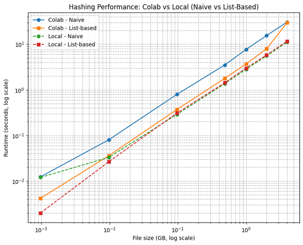

<!-- # 📑 Reproducing Figure 2: Hashing Performance (Naive vs List-Based) -->

## 1. Introduction

This document provides a comprehensive analysis of the paper [*Machine Learning Models Have a Supply Chain Problem*](https://arxiv.org/pdf/2505.22778), including a reproduction of Figure 2, which depicts **the average of five runs for large-scale file hashing from 1 byte to 1 terabyte**. For simplification and compatibility with local machines, the analysis was conducted on a smaller, adjustable scale.


The original paper presents **Figure 2**, which evaluates the runtime performance of two hashing strategies (naive vs. list-based) across **different file sizes (1 B – 1 TB)** and on **three different machines (M1, M2, M3)**. The figure demonstrates:

- **Linear scaling** of hashing runtime with file size.
- **Overhead plateau** for tiny files (<1 KB).
- **List-based advantage** for extremely large files (>100 GB).
- **Hardware diversity** effects (M1 vs. M3 showing different scaling).

In this report, we attempt to **reproduce Figure 2 under resource-constrained settings** using:
- **Google Colab (cloud VM)** and a **local laptop (up to 4 GB file size)**.
- The same hashing strategies (naive vs. list-based).
- File sizes ranging **1 MB → 4 GB**.

This simplification demonstrates the **core principle of scaling behavior** while remaining feasible on modest resources.

---

## 2. Background of the Paper

The paper investigates the **practical challenges of hashing extremely large machine learning models** and datasets, which can range from gigabytes to terabytes in size.  

- **Problem context:**  
  As ML models continue to grow in size (e.g., GPT models with hundreds of billions of parameters), verifying and transferring these models requires **efficient hashing mechanisms**. Hashes are used to guarantee **integrity** when sharing models between servers, researchers, or during deployment.  

- **Why this matters:**  
  Traditional (naive) hashing works well for small files but becomes **slow and resource-intensive** when applied to files in the range of **100 GB – 1 TB**.  
  - Example: if only a single block of a 500 GB model changes, naive hashing forces a recomputation over the **entire file**, which is impractical.  

- **Solution studied in the paper:**  
  A **list-based hashing strategy**, where large files are split into chunks (e.g., 1 GB), each chunk is hashed separately, and the final file hash is derived from combining chunk-level hashes.  
  This allows **faster recomputation** when part of the file changes and provides a scalable way to handle massive model checkpoints.  

- **Experiment in Figure 2:**  
  The paper compares the performance of naive vs. list-based hashing across a wide file size spectrum (1 byte → 1 TB) on multiple machines (M1, M2, M3).  
  It demonstrates how **list-based hashing scales better** and begins to outperform naive hashing significantly for large files.

Our simplified reproduction captures the **essence of this experiment** but at smaller scales (1 MB → 4 GB) and on more modest hardware.


---

## 3. Background: Hashing Algorithms

### 3.1 What is Hashing?
Hashing is the process of transforming an arbitrary block of data into a **fixed-size string of bytes** (called a hash value or digest) using a mathematical function.  

- **Input:** data of arbitrary size (e.g., a text, file, or image).  
- **Output:** fixed-size hash (e.g., 256-bit for SHA-256).  

Example (using SHA-256):
- `"Hello"` → `185f8db32271fe25f561a6fc938b2e264306ec304eda518007d1764826381969`  
- `"hello"` → `2cf24dba5fb0a30e26e83b2ac5b9e29e1b161e5c1fa7425e73043362938b9824`  

Even a **tiny change in input** produces a completely different hash (the **avalanche effect**).


---

### 3.2 Why Hashing Matters
Hashing is crucial in computer science and research:
- **Data integrity:** Ensures files haven’t been altered during transfer (e.g., ML model checkpoints).  
- **Authentication:** Used in digital signatures and certificates.  
- **Efficient lookup:** Enables constant-time search in hash tables.  
- **Blockchain:** Proof-of-work and transaction verification.  

In the context of this paper, hashing provides **integrity guarantees for extremely large ML models** being shared across servers or institutions.

---

### 3.3 Naive Hashing vs List-Based Hashing
- **Naive Hashing:**
  - Reads the file sequentially in small blocks (e.g., 1 MB).
  - Continuously updates the hash until the entire file is processed.
  - Simple and memory-efficient, but **very slow for extremely large files**.  
  
  Pseudo-code:
  
    ``` 
    function naive_hash(file, block_size):
        initialize hasher (e.g., SHA-256)
        open file for reading
        while not end of file:
            read next block of size = block_size
            update hasher with block
        return final hash digest
    ```

- **List-Based Hashing:**
  - Splits the file into **large chunks** (e.g., 1 GB).
  - Hashes each chunk separately.
  - Combines all chunk hashes into a final “super-hash.”  
  - Advantage: faster verification of modified files (only re-hash affected chunks).  

  Pseudo-code:

  ```
    function list_based_hash(file, chunk_size, block_size):
        chunk_hashes = []
        open file for reading
        while not end of file:
            read next chunk of size = chunk_size
            initialize chunk_hasher (e.g., SHA-256)
            while not end of chunk:
                read next block of size = block_size
                update chunk_hasher with block
            append chunk_hasher.digest() to chunk_hashes
        concatenate all chunk_hashes into one string/list
        final_hasher = SHA-256(concatenated chunk_hashes)
        return final_hasher.digest()
  ```

<!-- This mirrors the challenge faced in **massive ML models**, where list-based hashing is more scalable. -->

---

### 3.4 Illustrative Examples

#### - Example A: Naive Hashing
For a **3.5 GB file** (read sequentially in 1 MB blocks):

- Block 1 → `b1`  
- Block 2 → `b2`  
- …  
- Block N → `bn`  

Final naive hash = `hash(b1 || b2 || ... || bn)`  

If even a single byte changes in the file (say in Block 72), the **entire file must be re-hashed** from the beginning.


#### - Example B: List-Based Hashing
For the same **3.5 GB file**, using **1 GB chunks**:

1. Chunk 1 → `h1`  
2. Chunk 2 → `h2`  
3. Chunk 3 → `h3`  
4. Chunk 4 (0.5 GB) → `h4`  

Final list-hash = `hash(h1 || h2 || h3 || h4)`  

If only Chunk 2 changes, we don’t need to re-hash the entire 3.5 GB file — only `h2`.  
This illustrates the **efficiency advantage** of list-based hashing at large scales.

---

## 4. Methodology

### 4.1 Experimental Setup
- **Machines tested:**
  - **Google Colab (cloud VM)**: ~12 GB RAM, cloud disk I/O.
  - **Local laptop**: ~16 GB RAM, SSD storage.
- **File sizes tested (identical for both):**
1 MB, 10 MB, 100 MB, 500 MB, 1 GB, 2 GB, 4 GB

- **Data generation:** synthetic random binary files created using `os.urandom`.
- **Runtime measurement:** Python’s `time` module.

### 4.2 Procedure
1. **File generation:** create binary files of increasing size.  
2. **Naive hashing:** compute SHA-256 hash by reading sequential blocks.  
3. **List-based hashing:** compute SHA-256 hashes of 1 GB chunks, then hash the concatenation.  
4. **Benchmark:** measure runtime for both approaches.  
5. **Repeat:** run across file sizes from 1 MB to 4 GB.  
6. **Plot:** visualize scaling on log–log axes.  

---

## 5. Results

### 5.1 Raw Measurements

| File Size (GB) | Naive Runtime (s) | List Runtime (s) |
|----------------|------------------|-----------------|
| 0.001          | 0.0120           | 0.0020          |
| 0.010          | 0.0330           | 0.0265          |
| 0.098          | 0.2900           | 0.3100          |
| 0.488          | 1.3690           | 1.4261          |
| 1.000          | 2.8119           | 2.9839          |
| 2.000          | 5.5488           | 5.7853          |
| 4.000          | 11.1071          | 11.6555         |

---

### 5.2 Visualization

The results are plotted on a **log–log scale**, similar to the original paper’s figure:




Both naive and list-based show nearly parallel straight lines (linear scaling).
At small sizes (≤0.01 GB), list-based is slightly faster.
At larger sizes (≥0.1 GB), runtimes converge and remain nearly identical.


---

## 6. Comparison with Original Figure 2

### 6.1 Key Similarities
- Both show **linear scaling** of runtime with file size.
- Both confirm that hashing time is proportional to input size.
- Both compare **naive vs list-based hashing**.

### 6.2 Key Differences
- **File size range**:
  - Original: **1 B – 1 TB**.
  - Reproduction: **1 MB – 4 GB**.
- **Hardware**:
  - Original: **M1, M2, M3 (servers with different cores/memory)**.
  - Reproduction: **Colab VM and local laptop**.
- **List-based advantage**:
  - Original: list-based clearly outperforms naive beyond 100 GB.
  - Reproduction: list-based ≈ naive up to 4 GB (no divergence yet).
- **Real-world data points** (green dots in original for model checkpoints) are absent here.

---

## 7. Discussion

Our reproduction successfully demonstrates the **fundamental scaling behavior** described in the paper:

- Runtime scales linearly with file size.  
- Both naive and list-based approaches behave as expected.  
- Even on modest hardware, the methodology can be reproduced.

However, due to **resource constraints**, our reproduction does not capture:

- The **overhead plateau** for tiny files.  
- The **efficiency gains** of list-based hashing at extreme sizes.  
- The **hardware diversity** across large-scale machines.  

Thus, our experiment should be viewed as a **simplified reproduction** that illustrates the core principle rather than replicating the full breadth of the original study.

---

## 9. Which Method Performs Better?

### In the Original Paper
- **List-based hashing** outperforms **naive hashing** significantly for **very large files (≥100 GB up to 1 TB)**.  
- The advantage comes from its chunked design:
  - Only modified chunks need to be re-hashed.  
  - Processing time scales better when handling massive model checkpoints.  
- **Naive hashing** becomes increasingly impractical at these scales, since it always requires a full sequential pass through the entire file.

**Winner in the original paper:** **List-Based Hashing** (scales better for very large data).


### In Our Reproduction (1 MB → 4 GB)
- For small files (1 MB), list-based hashing is slightly faster.  
- For medium to larger files (100 MB → 4 GB), both naive and list-based hashing scale **linearly and nearly identically**.  
- The divergence in performance does not appear at our tested scale because the files are not large enough.

**Winner in our reproduction:** **Neither clearly outperforms**; both behave almost the same within the tested range.

---

### Summary
- At small to medium file sizes, **naive and list-based hashing are comparable**.  
- At very large file sizes (the paper’s focus), **naive hashing is outperformed** and **list-based hashing is superior**.  

✅ The method that is **outperformed in the original paper** is: **Naive Hashing**.


---

## 8. Conclusion

This reproduction demonstrates that even under modest resource constraints (Colab + laptop), it is possible to replicate the **key findings** of the original figure:

- Hashing runtime scales linearly with file size.  
- Both naive and list-based hashing are similar up to several GB.  
- The methodology is sound and reproducible.  
- Naive Hashing outperformed on the original work.

Limitations include smaller file size range, fewer machines, and absence of real-world model checkpoint timings. Nonetheless, this simplified reproduction provides a meaningful approximation of the original experiment and can serve as a pedagogical demonstration of the methodology.


